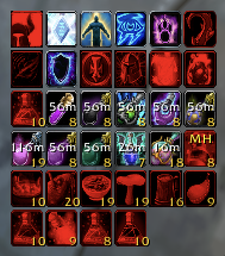

# Akkio's Consume Helper

A buff and consumable tracking addon for Turtle WoW (WoW 1.12).

---

---

## Buff Status Bar

- **Configurable icon bar** — track any combination of buffs and consumables at a glance
- **Color-coded status** — icons turn red when missing
- **Countdown timers** — remaining duration displayed on each active consumable
- **One-click actions** — use a consumable, apply a weapon enchant, or request a buff from the group

## Shopping List

- **Stock tracking** — bags, bank, and mailbox
- **Color-coded status** — green (stocked), orange (bags low but bank/mail covers it), red (genuinely short) - editable thresholds
- **Crafting materials** — shown in the tooltip of each item

## Slash Commands

| Command | Action |
|---|---|
| `/act` | Open Select Buffs tab |
| `/actsettings` | Open Settings tab |
| `/actbuffstatus` | Force refresh buff bar |
| `/actreset` | Reset all settings to defaults |
| `/actwelcome` | Show welcome screen |

## Installation

1. Extract to `Interface/AddOns/`
2. Restart the game
3. Click the minimap button to open the addon

---

*Created by Akkio for Turtle WoW 1.12*
